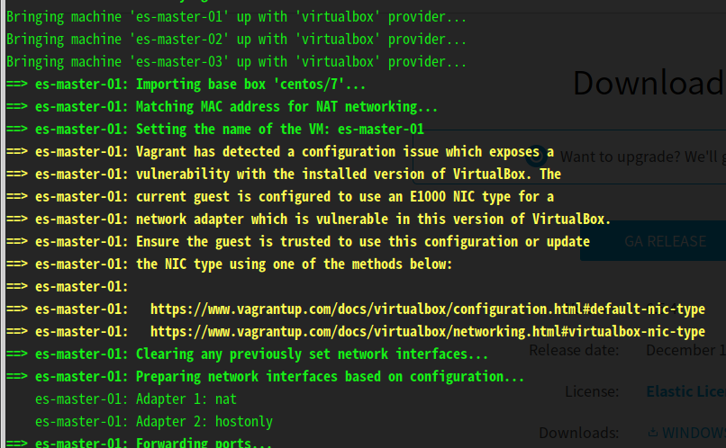

# Vagrant + Virtualbox

{}
注意：快速开始是以本地创建 3 台虚拟机并部署 ELK 为例。需要消耗大约 24GB 内存和 12 个 CPU 线程。
{}

## 安装 Vagrant
#### 根据你的系统平台，访问 https://www.vagrantup.com/downloads.html 下载并安装对应版本的 Vagrant。

## 安装 VirtualBox
#### 根据你的系统平台，访问 https://www.virtualbox.org/wiki/Linux_Downloads 下载并安装对应版本的 VirtualBox

## 进入项目目录

```bash
cd ~/Workspace/ansible-elk-deploy
```

{}
注意：初次使用，建议把 `group_vars/all.yml` 里的 `searchguard_enabled: true` 改为 `searchguard_enabled: false`。 因为你需要了解 [Search Guard](https://docs.search-guard.com/latest/internal-users-database) 才能知道如何建立账号权限。
{}

## 启动虚拟机

``` bash
vagrant up
```


{}
**注意**</br>
第一次部署，需要下载虚拟机镜像。 这个时间会有点长。<br/>
然后会自动执行 ansible playbook，进行 ELK 部署。
{}

## 访问你的 ELK 服务
| 服务   | URL                        | 账号密码(如果启用了 Search Guard) |
| ------ | -------------------------- | --------------------------------- |
| Kibana | http://172.28.128.101:5601 | haibin:newtouch                   |
