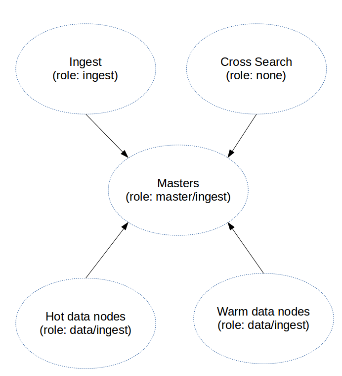
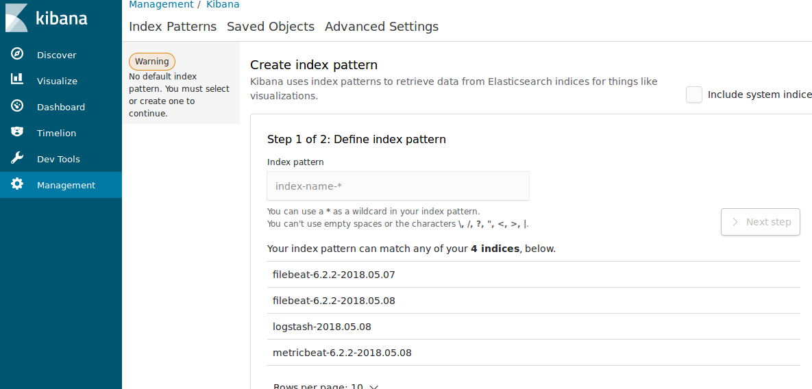
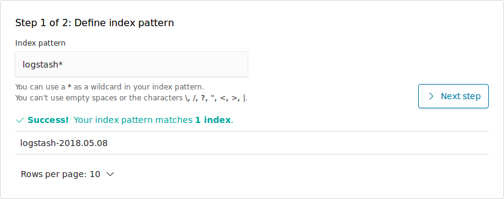
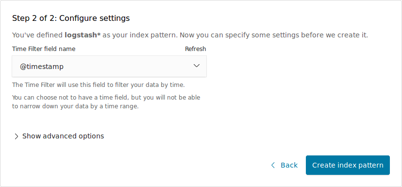
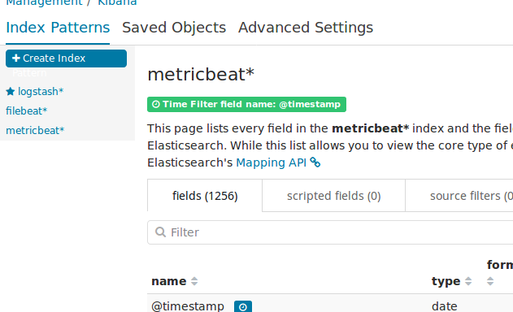
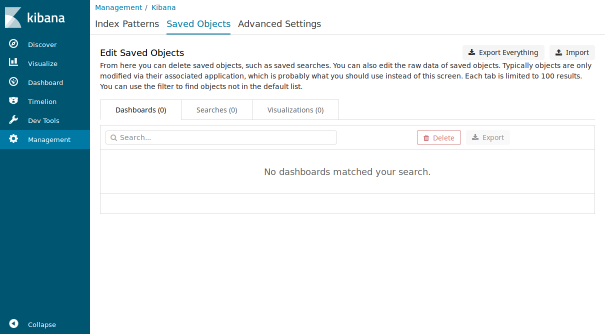
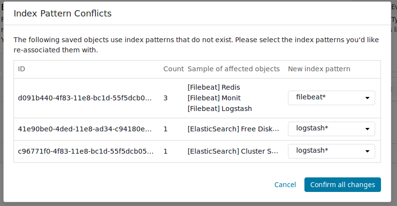

# 服务依赖关系
## 1. Elasticsearch 依赖关系

## 2. Consul 依赖关系
（图暂缺）

# 部署前的准备
## Elasticsearch 数据盘容量估算公式
以每条日志 1kb 大小为例，每秒产生 1000 条日志记录，不做任何解构的前提下，每天的数据存储量在 86GB 左右。2TB 磁盘空间可以存储 23 天左右的日志。

## 配置要求
|名称|要求|
|---|---|
|系统|Ubuntu xenial(推荐)，或 CentOS 7 |
|CPU |4+|
|内存|8GB+|
|数据盘|非系统盘，格式 xfs。容量根据日志量公式推导计算|

# 主机编排
1. 最小部署仅演示或测试，不可扩展。
1. 中型部署可以向大型部署扩展，只需给对应的组添加主机即可。
1. `共用`表示该组机器同时可以存在于其它组。
1. 把 `group_vars/all.yml.example` 复制为 `group_vars/all.yml`，然后根据实际情况修改对应的变量值。
1. 把 `hosts.ini.example` 复制为 `hosts.ini`，根据以下部署规划，编排主机和主机组。

## 最小部署：3 主机。
在 hosts.ini 里定义。

|组名|主机数|共用|
|---|---|---|---|
|elasticMasterNode|3|是|
|elasticHotNode|0||
|elasticWarmNode|0||
|redis|0||
|logstash|3|是|
|kibana|3|是|

## 中型部署：9 主机。
在 hosts.ini 里定义

|组名|主机数|共用|备注|
|---|---|---|---|
|elasticMasterNode|3|否|不存储数据|
|elasticHotNode|3|否|存储数据|
|elasticWarmNode|0|||
|redis|0|||
|logstash|3|是||
|kibana|3|是|||

## 大型部署：16+ 主机。
在 hosts.ini 里定义

|组名|主机数|共用|备注|
|---|---|---|---|
|elasticMasterNode|3|否|不存储数据|
|elasticHotNode|3|否|存储热数据|
|elasticWarmNode|3|否|存储冷数据|
|redis|3|否||
|logstash|2+|否||
|kibana|2+|否|||

# 部署过程
## 全新部署
执行 `ansible-playbook play-all.yml`

## 分解部署
### 00-downloaded_files.yml
下载所需文件。如果是要在离线环境部署，需先执行该剧本。

### 01-env_init.yml
1. 初始化所有目标服务器的环境。安装 chrony NTP 服务。
1. 这是公用剧本。任何主机数量的增减，都需要执行一次。

### 02-deploy_consul.yml
1. 部署 consul 服务。用于服务自注册，内部 DNS 解析。
1. consul master 节点与 elasticsearch master 节点共存。
1. 其余节点都是 client 模式。
1. 这是公用剧本。新增的主机都需要执行一次。

### 03-deploy_redis.yml
1. 一般 3 节点为 1 集群，节点数不可为偶数。
1. 部署 redis 服务。
1. 启用 sentinel 做监控和主从切换。
1. consul 用于检测哪个节点是 master 并更新 DNS 解析。

### 04-deploy_elasticsearch.yml
1. 部署 ElasticSearch 集群。
1. 至少 3 节点为 1 集群，而且节点数不可为偶数。

### 05-deploy_kibana.yml
1. 部署 kibana。
1. 主机数在 1～3 个即可。具体根据业务场景来定。
1. 如果是大规模环境，同一主机会部署一个 ElasticSearch Cross Search 实例，仅作跨集群的搜索路由，不参与数据相关的业务。

### 06-deploy_logstash.yml
1. 部署 logstash 集群。主机数可根据负载弹性伸缩。

### 07-deploy_beats.yml
1. filebeat 默认采集本架构内相关服务的日志。
1. metricbeat 采集主机状态、kibana 状态、elasticsearch 状态。
1. redis 或 logstash 节点伸缩，无需改变 beats 的 output，因为是通过 consul 做 DNS 解析。
1. 这是公用剧本。新增的主机都需要执行一次。

### 08-deploy_monit.yml
1. 用于监控告警。具体看 roles/deploy.Monit/templates 里的监控配置。
1. 这是公用剧本。任何主机数量的增减，都需要执行一次。

## 部署报告
所有服务的配置都会下载到本地的 `install_report` 目录下，以便查看。

# 后续
## 部署完成后，等待大约 3 分钟，相关日志进入 index 后，打开浏览器访问 kibana 主机的 5601 端口，分别建立 logstash、filebeat 和 metricbeat 索引。

### 进入 Management -> Index Patterns

### 用通配符匹配对应的 index 名称。

### 使用 @timestamp 作为时间排序依据。

### 3 个基本索引的建立

### 切换到 Saved Objects，点击 Import 按钮，选择 `kibana_templates/init-template.json` 并点击“完成”。

### 提示要指定 index 的对话框，按以下图示设置并确认。

### 最后就可以前往 Dashboard 里查看了。

# 升级操作
## ELK 版本升级。
1. 修改 `group_vars/all.yml` 里的 `elk_version` 值。
1. 执行 `ansible-playbook 98-upgrade_elk_cluster.yml"` 即可。
1. 该脚本会自动检测比对版本号，高于现有版本号才执行更新操作。
1. 升级步骤按照官方文档指导而编写，基本上安全无害。
1. 必须逐台主机升级，请勿修改 playbook 里的 serial 参数。
1. 只提供升级，不提供降级。请在测试环境测试 OK 再到生产环境执行。

## Monit 版本升级
1. 修改 `group_vars/all.yml` 里的 `monit_version` 值。
1. 执行 `ansible-playbook 08-deploy_monit.yml"` 即可。

## Consul 版本升级
1. 修改 `group_vars/all.yml` 里的 `consul_version` 值。
1. 执行 `ansible-playbook 02-deploy_consul.yml"` 即可。

## Redis 版本升级
1. 修改 `group_vars/all.yml` 里的 `redis_version` 值。
1. 执行 `ansible-playbook 03-deploy_redis.yml"` 即可。
